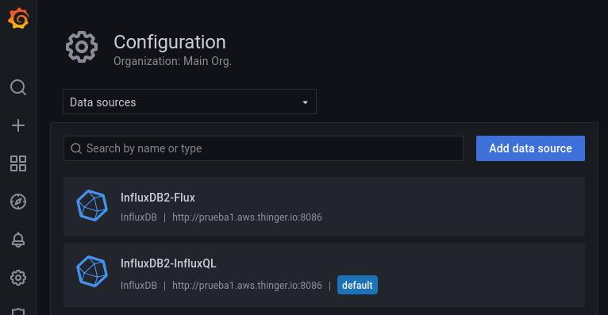
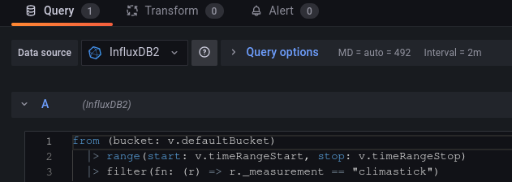

# Grafana Plugin

_Grafana_ is an Open Source visualization and analytics software that allows to query, visualize, alert on, and explore metrics no matter where they are stored. This integration plugin allows working together with Grafana & Thinger.io, providing a lot of new tools to analyze IoT devices data with amazing graphs and visualization widgets.&#x20;

.png>)


[Note: Plugins are only available for premium Thinger.io serves. Check **this link** to create your own instance within minutes](https://pricing.thinger.io).


Grafana's technology allows for the simple development of advanced dynamic dashboards for data visualization and analysis, create logs, metrics, or even automatic alerts. And all these capabilities are extensible thanks to a large widget import repository, in which we can acquire many different representation elements created by Grafana's own developers or by contributions from a large community of users. A lot of additional information can be found on the creator's website and also in their extensive documentation, available at [**this link**](https://grafana.com/docs/grafana/v8.5/getting-started/?src=grafana\_gettingstarted).

.png>)

The integration of this technology becomes a very useful tool for Thinger.io users who need to take their dashboards to a professional level, perform complex analytics in a scalable way, or create visualization projects in collaboration with other developers on their team. This plugin allows you to create an infrastructure in which Thinger.io acts as an element of administration and management of the devices. The data is stored through InfluxDB and finally, Grafana extracts the time series to create the representation.

## Starting with Grafana Plugin&#x20;

Once the standard plugin deployment process has been done ([as explained here](./)), the Grafana plugin requires few additional steps to be ready to work with Thinger.io devices data. In the following sections, we explain how to log in and how to complete the configuration of the plugin successfully

### First Login

When the plugin is newly installed, the first login should be done using your Thinger.io account username and the password "**admin**". Once the first login occurs the system will ask to change the password to put a custom one. After this, it is possible to see the Grafana workspace with its different options.&#x20;

### Adding a Datasource

The link between the Thinger.io data and the Grafana plugin is done by adding the buckets database as a "new data source" for Grafana. By default, the configuration against the database is already configured, with the name **InfluxDB2-Flux** and **InfluxDB2-InfluxQL**, and no further actions are required.


Due to performance issues with Flux query language, we recommend to use the InfluxQL backend, unless Flux provides a feature no available with InfluxQL.


Nevertheless, an additional data source may be configured if required. More information in this [link](https://grafana.com/docs/grafana/latest/datasources/).

## Working with Grafana

### Creating a new dashboard

Once the data source has been configured, the most common way to start working with Grafana is to create a new dashboard for data representation. To do this, click on the + button in the Grafana main menu and select "new dashboard". This will open a new empty dashboard ready to be configured with a custom layout and representation panels by clicking on the button "+Add new panel", that will open the panel configuration context, which is organized in two sections:

* **Panel Configuration**: On this step, we can choose the kind of graph to be used in the widget, for example time series charts, It is interesting to you explore all the options offered by this menu, both in display types and in other panel configurations that allow you to choose the legend, the axes, etc.

.png>)

* **Data configuration in InfluxQL:** The "Query" configuration panel allows selecting the variables to be shown in the new panel. This process can be done in three steps:
  1. Select the Datasource using the left-side drop-down menú (InfluxDB2-InfluxQL in our example).
  2. Select a Data Bucket profile from those created on Thinger.io with the FROM field.
  3. Using the SELECT field it can be selected one or more specific variables from the Data Bucket.

.png>)

* **Data configuration in Flux:** The "Query" configuration panel allows selecting the variables to be shown in the new panel. This process can be done in three steps:
  1. Select the Datasource using the left-side drop-down menu (InfluxDB2-Flux in our example)
  2. Write the desired data using [Flux syntax.](https://docs.influxdata.com/influxdb/v2.2/query-data/get-started/) More information in Grafana's official [documentation](https://grafana.com/docs/grafana/next/getting-started/get-started-grafana-influxdb/#flux-query-language).

* **Transform data:** Allows to filter or aggregate devices data using different tools before it will be shown in the representation panel.&#x20;
* **Automatic Alerts**: The graph process can be configured to work in the background evaluating the variables received to generate alerts in real-time. This panel allows the configuration of many parameters for the creation of alerts in a personalized way.

### Adding new widget types

Grafana is a very flexible tool, users can add new panels as they go, retrieving them from different repositories. These panels are developed by the Grafana team but also by community contributors, allowing this technology to grow very quickly thanks to the group effort. The process to add new elements in the Grafana Plugin of Thinger.io is through the command console of the docker container in which the program is executed locally. In it, a command is introduced that allows you to quickly download and install components as explained below:

1\. The first step is to find the new element to add, the following link leads to the official Grafana plugin repository: [https://grafana.com/grafana/plugins](https://grafana.com/grafana/plugins)\
2\. Obtain the CLI installation command of any new panel or plugin that wants to be added.  \
3\. Access Grafana's shell, to do so, just click on the Plugins tab in the Thinger.io main menu, then access Grafana's profile in the Plugins Marketplace.

.png>)

4\. Once inside click on the _>\_Shell_ option and click on "connect". Then the download and installation command can be pasted into the console and executed.&#x20;

.png>)

5\. After the installation of any new element in Grafana it is necessary to restart the plugin-container. This process is done through the plugin's function bar by means of the Restart button.

## Providing public access to share Grafana projects

Grafana can be configured to create collaborative working groups in order to share resources with read-only or editing privileges, which is a quite useful feature to create visualization interfaces for customers. The process required to implement this feature is quite simple on Grafana, as explained below

1. Going to the "permissions" section of the dashboard that wants to be shared, press the blue "Add permission" button.&#x20;
2. Then in the "Add permission for" section, select the user or the team with whom the dashboard will be shared &#x20;
3. Finally, select the privileges that want to be granted&#x20;

.png>)

However, when Grafana is running into a Thinger.io plugin, an additional configuration needs to be done in order to provide public access to the program.&#x20;

4\. Going to Thinger.io Plugins marketplace section, select Grafana profile to access the plugin configuration interface\
5\. Clicking into the "Settings" tab, switch on the public access button&#x20;

.png>)

The result of this process is a publicly accessible dashboard that can be shared with third parties or resources that can be integrated into a Thinger.io standard dashboard as shown below.

